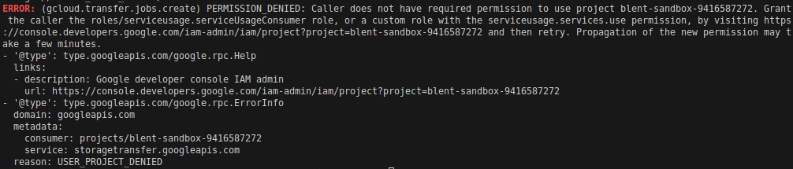
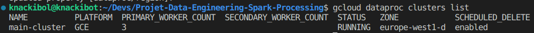
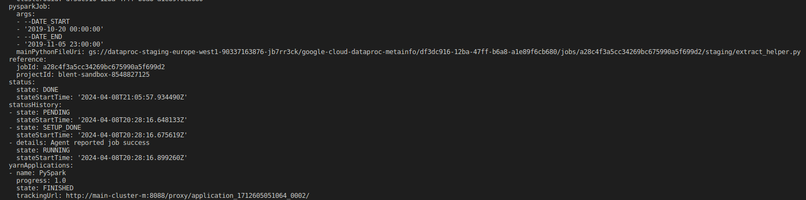
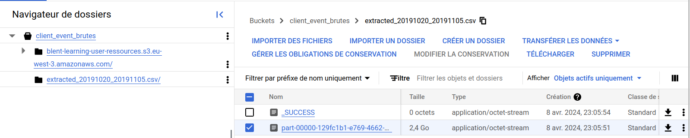

<div align="center">

  <h2 align="center">Création d'une base d'apprentissage ML à partir de données brutes</h2>

<div align="center"></div>

<h2 align="center">François Legland</h2>
</div>

## À propos du projet

Une entreprise ECommerce collecte de nombreuses informations sur ses utilisateurs lors de leurs visites et de leurs achats sur son site. Afin d'inciter les utilisateurs hésitant à finaliser leur parcours d'achat, elle cherche à proposer des coupons de réduction à ces utilisateurs. Au sein de l'équipe DataLab dont vous faites partie, plusieurs Data Scientists vont travailler sur un algorithme qui vise à construire un modèle prédictif qui va déterminer quels sont les utilisateurs susceptibles de finaliser leur parcours d'achat.

Afin de calibrer cet algorithme prédictif (Machine Learning), les Data Scientists ont besoin d'un historique de plusieurs jours d'événements qui peuvent s'étaler sur plusieurs semaines. En tant que Data Engineer, ton objectif est de construire un programme d'extraction sous forme de job Spark (Spark Scala ou PySpark) que les Data Scientists peuvent exécuter sur un cluster Hadoop lorsqu'ils souhaitent extraire les données brutes et obtenir une base d'apprentissage pour leur algorithme.

Les sections ci-dessous décrivent le protocole employé pour répondre à la problématique. 

## 1. Clôner le dépôt

Un dépôt git a été créé à l'occasion du projet. On commence par le clôner en local.

```shell
git clone https://github.com/FrancLgd/Projet-Data-Engineering-Spark-Processing.git
cd Projet-Data-Engineering-Spark-Processing
```

## 2. Télécharger en local l'échantillon de données

Premièrement, si ce n'est pas déjà fait, on installe en local la commande `wget`.

```shell
sudo apt-get update
sudo apt-get install wget
```

On récupère ensuite en local l'échantillon à l'aide de l'url fournie dans la description du projet.

```shell
wget https://blent-learning-user-ressources.s3.eu-west-3.amazonaws.com/projects/9c15cb/sample.csv
mv sample.csv data/sample.csv
```

## 3. Développer le script de mise en forme

Le jupyter notebook `./notebooks/extract_helper.ipynb` de prise en main a été développé en vue de tests. Nous sommes repartis de celui-ci en apportant diverses modifications pour créer le script de production `./src/extract_helper.py`.

## 4. Stocker les données brutes sur GCS

### 4.1 S'authentifier à GCP

Les commandes qui suivent permettent d'installer gcloud CLI si ce n'est pas déjà fait sur la machine.

```shell
curl -O https://dl.google.com/dl/cloudsdk/channels/rapid/downloads/google-cloud-cli-458.0.1-linux-x86_64.tar.gz
tar -xf google-cloud-cli-458.0.1-linux-x86_64.tar.gz -C ..
rm google-cloud-cli-458.0.1-linux-x86_64.tar.gz
../google-cloud-sdk/install.sh
```

On exécute ensuite les commandes ci-dessous pour s'authentifier à la Cloud Sandbox fournie par la plateforme. Une fenêtre navigateur va s'ouvrir, on y renseignera les accès demandés. 

```shell
gcloud auth revoke
gcloud auth login
gcloud config set project blent-sandbox-8548827125
```

### 4.2 Créer un bucket de destination nommé `client_event_brutes`

Nous allons créer un bucket dans le Google Cloud Storage fin d'y stocker les données brutes des événements utilisateurs.

```shell 
gsutil mb -l europe-west1 gs://client_event_brutes
```

### 4.3 Créer puis uploader le fichier .tsv sur GCS

Une fois le bucket en place, nous allons y transférer nos données sources à partir d'une liste d'adresses définie dans le fichier `./data/files_to_transfer.tsv`. Ce fichier est au préalable déposé dans notre bucket à l'aide de la commande suivante : 

```shell 
gsutil cp ./data/files_to_transfer.tsv gs://client_event_brutes/
```

Une fois déposé, nous le rendons publique (cf. erreur *Transfer Service* sinon).

```shell 
gsutil acl ch -u AllUsers:R gs://client_event_brutes/files_to_transfer.tsv
```

### 4.4 Créer le job de transfert pour les données brutes annuelles

Le job de transfert suivant est ensuite soumis via la commande :

```shell 
gcloud transfer jobs create \
    https://storage.googleapis.com/client_event_brutes/files_to_transfer.tsv \
    gs://client_event_brutes/
```

**ATTENTION :** cette étape est finalement réalisée manuellement dans l'interface GCP par manque d'autorisations sur la sandbox (cf. capture ci-dessous).



### 4.5 Créer une instance Dataproc : ceci est déjà fait par la sandbox

Notre job Spark devra tourner sur une instance Dataproc. Nous utiliserons ici celle qui est mise à disposition par la plateforme Blent.

## 5 Faire tourner le script sur le cluster Dataproc

### 5.1 Vérifier si le cluster existe bien

Les commandes suivantes permettent simplement de s'assurer que le cluster visé existe bien.

```shell
gcloud config set dataproc/region europe-west1
gcloud dataproc clusters list
```

Nous voyons ci-dessous que notre cluster nommé `main-cluster` apparaît bien et est en cours d'exécution.



## 5.2 Soumettre le job pyspark

Pour finir nous soumettons un job avec deux mois différents et avec un écart de 2 semaines:

```shell
gcloud dataproc jobs submit pyspark \
    --cluster main-cluster \
    --region europe-west1 \
    ./src/extract_helper.py \
    -- \
    --DATE_START "2019-10-20 00:00:00" \
    --DATE_END "2019-11-05 23:00:00"


gcloud dataproc jobs submit pyspark \
    --cluster main-cluster \
    --region europe-west1 \
    ./src/extract_helper.py \
    -- \
    --DATE_START "2019-10-20 00:00:00" \
    --DATE_END "2019-10-20 23:00:00"
```

Après environ 40min de traitement sur le cluster, le job se termine correctement :



Et le fichier csv souhaité est bien présent dans notre bucket :



Un exemple de fichier de sortie obtenue avec le script (sortie générée sur une période plus réduite pour des raisons de stockage limité sur le dépôt Git) est fournie avec `./data/`